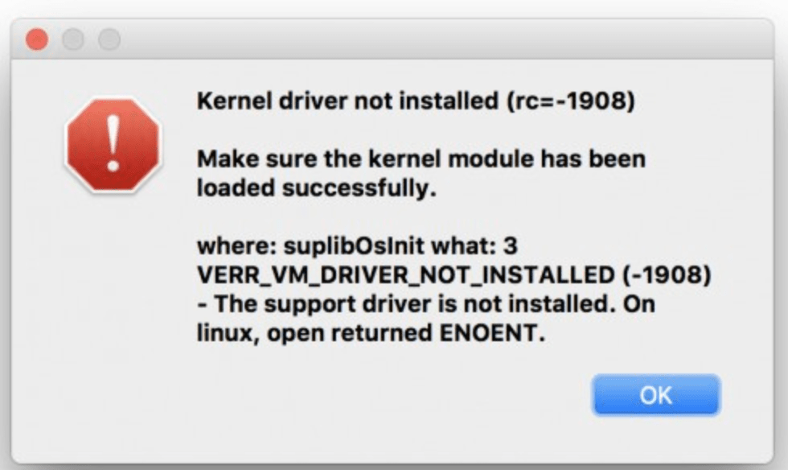
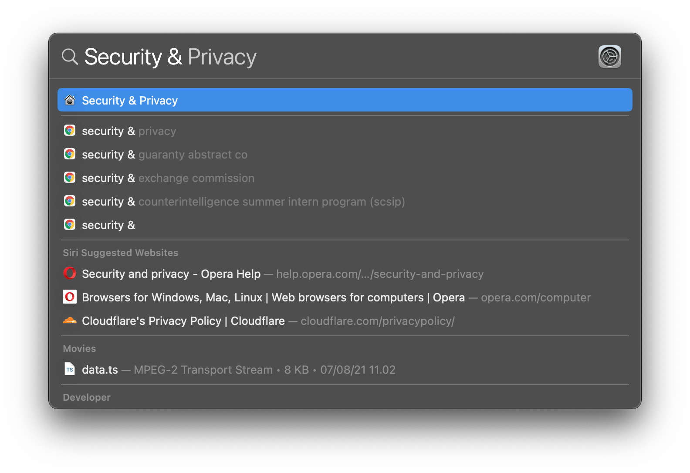
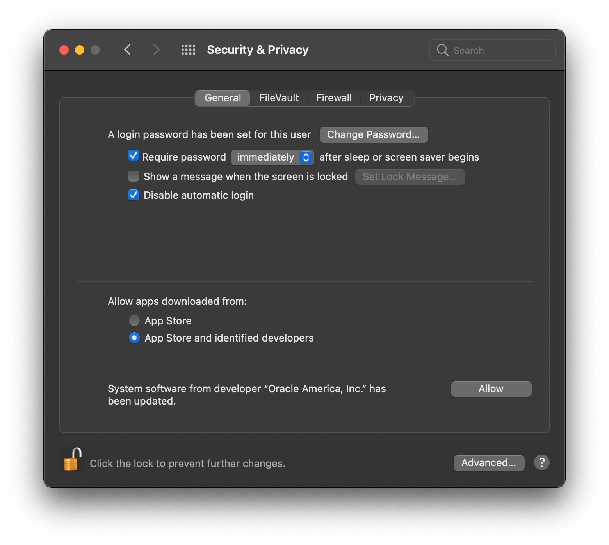
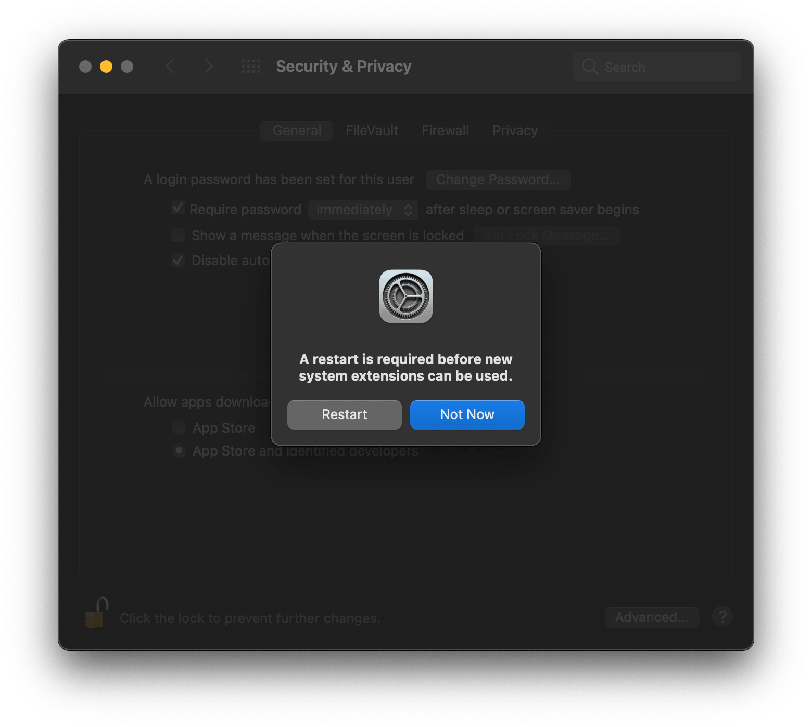
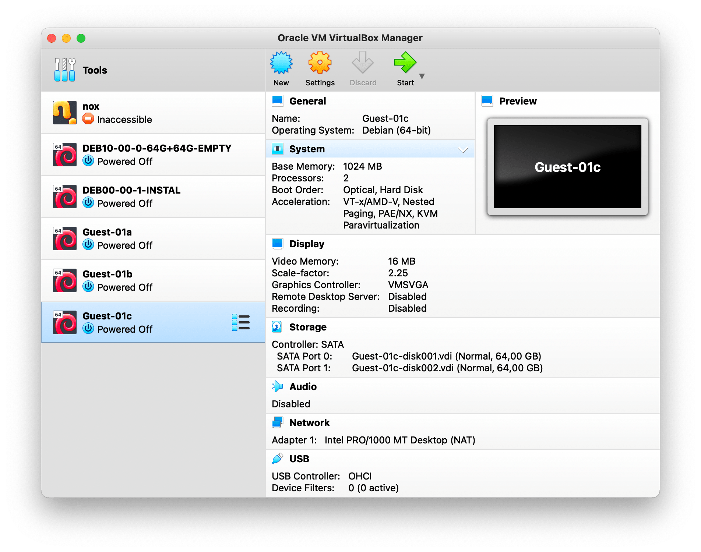
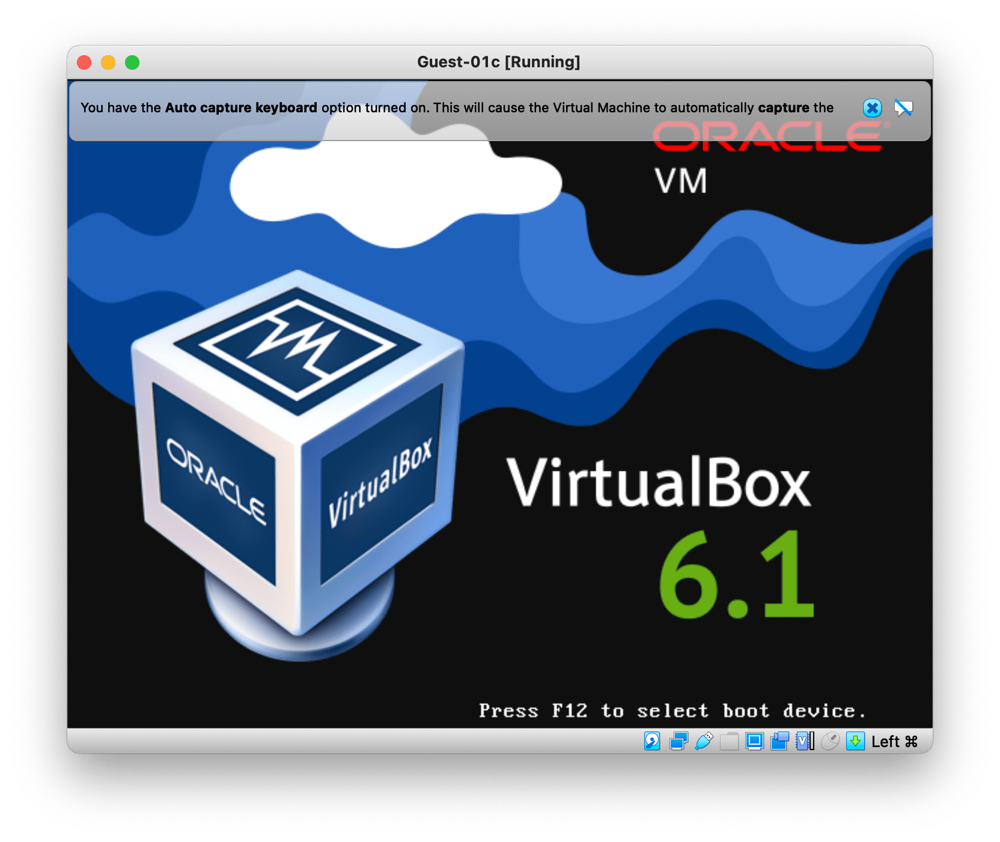

# Kernel Driver Error While Running VirtualBox

When you are trying to run your Debian Guest in VirtualBox, you probably will see this error caused by the incomplete setup of the Kernel Driver. Therefore, there are several things you need to do.   

1. Open Security & Privacy System Preferences by simply press &#8984; + `space` and type `Security & Privacy`  
   

2. Click on **Allow** button at bottom right 
   

3. Restart your device 
   

4. Reopen VirtualBox 
   

5. Rerun Debian Guest 
   
