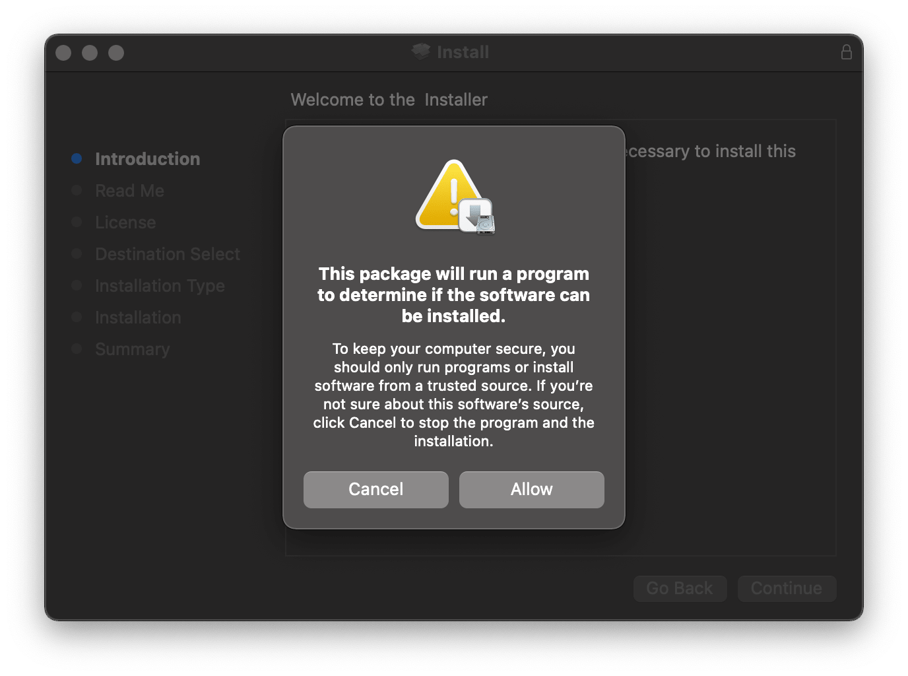
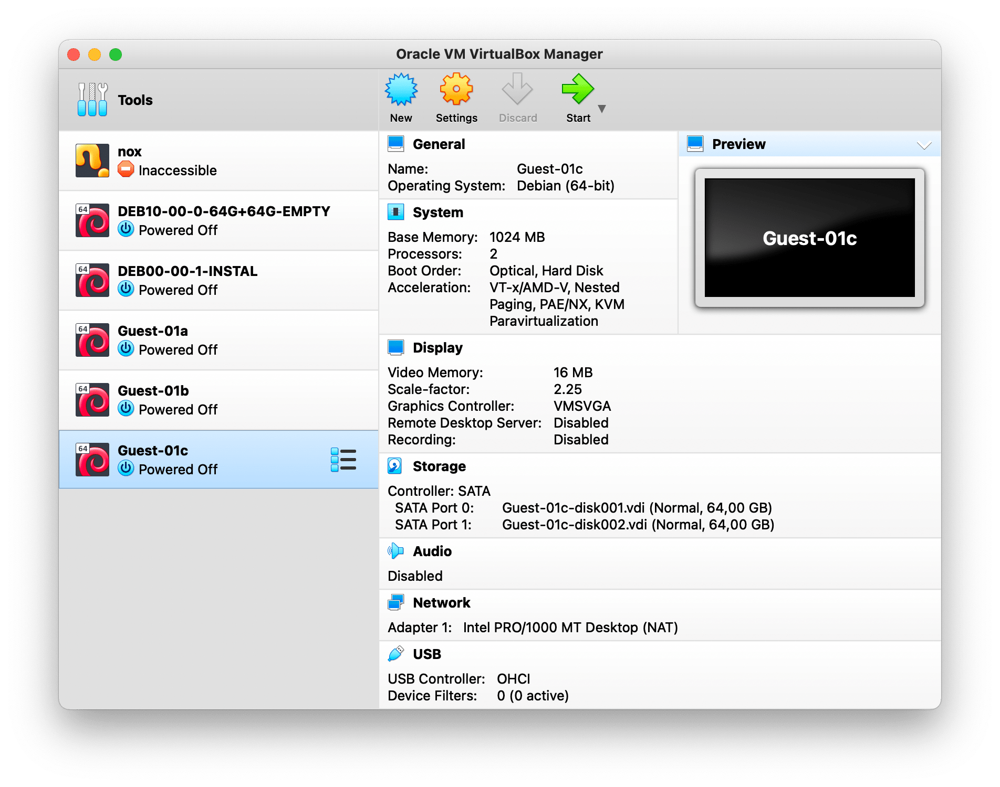

# X11 On MacOS

## You probably will not find any X11 application for MacOS. But there is an alternative; issued by the X.org as well, we can use XQuartz.

  

1. Go to https://www.xquartz.org/ and download XQuartz dmg file. This is the 2.8.1 version, you might find different versions from releases menu on the side bar. 
   

2. Run XQuartz installation program 
   

3. Click on XQuartz.pkg 
   

4. Allow 
   

5. Continue 
   

6. Continue 
   

7. Continue 
   

8. Agree 
   

9. Install 
   

10. Close (The program might ask you to logout or restart your device. If so, do as it says) 
    

11. Run your Debian Guest 
    

    

12. Open Finder > Applications > Utilities 
    

13. Search for XQuartz, right click and choose **New Terminal at Folder**  
    

    

14. Connect to your Debian Guest 
    

15. XQuartz icon should show up at the dock by now 
    

16. Display check and displaying clock 
    

17. Hit `control + C` to stop displaying clock 
    
