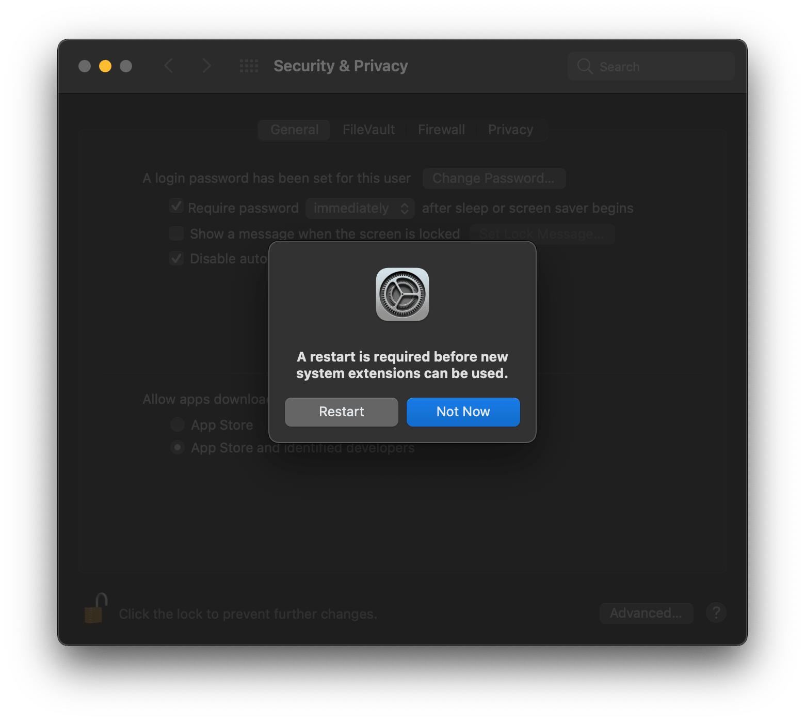

# Updating Virtual Box

1. Check for update 
   

2. Click on download virtual box 
   

3. Run the latest Virtual Box dmg file 
   

4. Click on VirtualBox.pkg 
   

5. Allow 
   

6. Continue 
   

7. Install 
   

8. Open Security Preferences 
   

9. Click on **Allow** button at bottom right 
   

10. Restart your device 
    

11. Open VirtualBox from Finder > Applications 
    

12. Open VirtualBox 
    

13. Check for update (again) 
    

14. Your VirtualBox has been updated 
    
