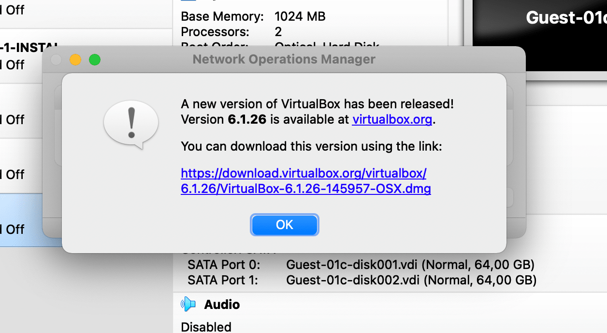

# Updating Virtual Box

## 1. Check for update

   

## 2. Click on download virtual box

   

## 3. Run the latest Virtual Box dmg file

   

## 4. Click on VirtualBox.pkg

   

## 5. Allow

   

## 6. Continue

   

## 7. Install

   

## 8. Open Security Preferences

   

## 9. Click on **Allow** button at bottom right

   

## 10. Restart your device

   

## 11. Open VirtualBox from Finder > Applications

   

## 12. Open VirtualBox

   

## 13. Check for update (again)

   

## 14. Your VirtualBox has been updated

   
